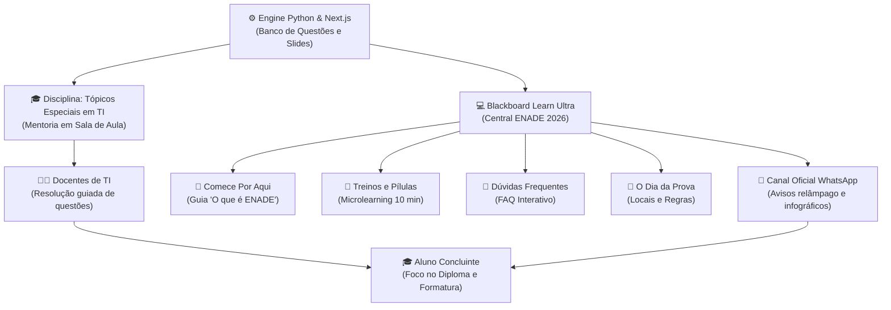

# 🏛️ Ecossistema Central ENADE — Gestão, Comunicação e Blackboard

> [!IMPORTANT]
> **GUIA MANDATÓRIO DE CONTEXTO INSTITUCIONAL E PEDAGÓGICO:**
> Este repositório não é apenas um motor técnico de processamento de PDFs/questões em Python e Next.js. Ele é a **espinha dorsal de um ecossistema completo de preparação acadêmica, comunicação e mentoria institucional** chamado **Central ENADE**, implementado para os cursos de Tecnologia da Informação (ADS, GTI, CCP) da Universidade Cruzeiro do Sul.

---

## 1. Visão Geral do Ecossistema

O projeto integra tecnologia, governança acadêmica e comunicação multicanal para transformar a preparação do ENADE em uma experiência acolhedora, integrada à rotina dos estudantes e com **zero sobrecarga desnecessária**:

---

## 2. Estrutura de Documentos desta Pasta (`Portarias/`)

Para manter qualquer agente de IA ou membro da equipe 100% contextualizado, esta pasta foi organizada com os seguintes arquivos de referência:

| Arquivo | Descrição e Finalidade |
| :--- | :--- |
| **[`README.md`](file:///Users/guiyti/Desktop/ENADE/Portarias/README.md)** | Visão geral do ecossistema Central ENADE e mapa da pasta. |
| **[`ESTRUTURA_BLACKBOARD.md`](file:///Users/guiyti/Desktop/ENADE/Portarias/ESTRUTURA_BLACKBOARD.md)** | Mapeamento técnico e pedagógico do pacote exportado do Blackboard Ultra (`imsmanifest.xml`, arquivos `.dat`, `.html` embutidos e árvore TOC). |
| **[`AVISOS_BLACKBOARD.md`](file:///Users/guiyti/Desktop/ENADE/Portarias/AVISOS_BLACKBOARD.md)** | Régua completa de avisos programados no Blackboard (boas-vindas, reengajamento, liberação de treinos, cartão de confirmação e reta final). |
| **[`COMUNICACAO_WHATSAPP.md`](file:///Users/guiyti/Desktop/ENADE/Portarias/COMUNICACAO_WHATSAPP.md)** | Estratégia de mensagens instantâneas, roteiros de disparo e infográficos visuais (`infografico_enade_2026.png`). |
| **[`ALINHAMENTO_DOCENTES.md`](file:///Users/guiyti/Desktop/ENADE/Portarias/ALINHAMENTO_DOCENTES.md)** | Alinhamento pedagógico com os professores das disciplinas específicas e de *Tópicos Especiais em TI* (gestão 100% da coordenação vs. dinâmica em sala). |
| **[`NORMATIVAS_E_CRONOGRAMA_MEC.md`](file:///Users/guiyti/Desktop/ENADE/Portarias/NORMATIVAS_E_CRONOGRAMA_MEC.md)** | Resumo das Portarias MEC, Editais INEP, cronograma oficial e regras do Questionário do Estudante e do Dia da Prova. |

---

## 3. Principais Diretrizes e Filosofia do Projeto

1. **Foco no Diploma, não na burocracia:** O aluno concluinte de TI geralmente trabalha o dia todo. O discurso institucional enfatiza a formatura e a colação de grau, desmistificando o ENADE como um bicho de sete cabeças.
2. **Zero Sobrecarga para Professores:** A coordenação gerencia 100% as salas do Blackboard (*Central ENADE*). Os professores atuam como mentores em sala de aula, projetando e resolvendo questões diretamente nas aulas de *Tópicos Especiais em TI*.
3. **Microlearning e Comunicação Visual:** Textos longos são substituídos por infográficos visuais (`infografico_enade_2026.png`), páginas HTML responsivas (`enade.html`, `faq.html`) e pílulas de 10 a 15 minutos (sem o uso do termo intimidatório "simulado").
4. **Alinhamento Rigoroso com o INEP:** Cobrança constante do preenchimento do *Questionário do Estudante* no portal Gov.br, que é o único meio de liberar o Cartão de Confirmação e a colação de grau.
