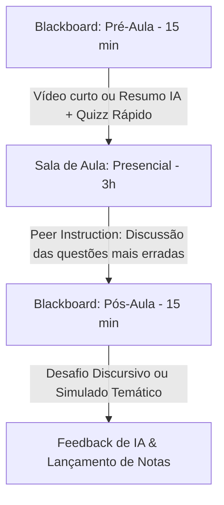

# PLANO DE DIRECIONAMENTO ESTRATÉGICO (PDE): ENADE 2026
## Cursos de Tecnologia - Universidade Cruzeiro do Sul

---

## 1. ANÁLISE DE CONTEXTO & DIAGNÓSTICO
* **Perfil do Estudante:** Majoritariamente noturno, 75% trabalha em período integral. Alta fadiga mental, tempo extraclasse nulo para estudo convencional. Qualquer estratégia baseada em "atividades extras obrigatórias" ou "grupos de estudo aos sábados" está fadada ao fracasso de engajamento.
* **Corpo Docente (~8 professores):** Generalistas, com tempo escasso para preparação de aulas específicas do ENADE. Não podem ser sobrecarregados com criação de material pedagógico ou burocracia de relatórios.
* **Equipe de Coordenação (Giulio e Claudio):** Tempo altamente limitado. A gestão do programa precisa ser centralizada em dashboards automatizados e geração de conteúdo assistida por IA.
* **Recursos Disponíveis:** Blackboard (ambiente de entrega único), banco de questões anteriores, autonomia pedagógica e disciplinas estratégicas de 3h semanais já integradas à grade.

---

## 2. RISCOS E MITIGAÇÕES OPERACIONAIS

| Risco Identificado | Causa Raiz | Ação Mitigadora (Prática) |
| :--- | :--- | :--- |
| **Abstenção no dia da prova** | Falta de incentivo percebido, cansaço do trabalho, desinteresse pelo índice institucional. | **Gatilho de Recompensa Imediata:** Atribuição de Horas Complementares (essenciais para colação de grau) proporcionais à realização dos simulados, além de nota direta (N1/N2) nas disciplinas de Tópicos. |
| **Desempenho por "chute" generalizado** | O aluno comparece apenas para assinar a presença e vai embora em 1 hora. | **Treinamento de Lógica de Questões:** Focar a dinâmica de sala de aula na desconstrução de distratores das questões do ENADE, em vez de repetição de conceitos teóricos puros. |
| **Resistência ou Fadiga Docente** | Professores se sentem sobrecarregados em preparar material para o ENADE. | **Material "Plug-and-Play":** Entregar semanalmente o roteiro exato da aula presencial (Guia de Facilitação) com análise de gabarito e dinâmica de grupo gerada por IA. |
| **Inconsistência entre Campi** | Múltiplas unidades aplicando revisões de formas heterogêneas. | **Masterização no Blackboard:** Criação de uma única disciplina "Master" no Blackboard replicada para todos os campi, garantindo a mesma régua de qualidade. |

---

## 3. OPORTUNIDADES E ALAVANCAS DE SUCESSO
* **Embarque Curricular Total:** As disciplinas *Tópicos Avançados em Sistemas de Informação II* (ADS) e *Tópicos Especiais em TI* (GTI) serão os veículos oficiais de preparação. A preparação para o ENADE não será uma atividade paralela, será a própria matéria.
* **Gamificação de Incentivos:** Transformar o progresso no Blackboard em conquistas:
  * Conclusão de 100% dos simulados = Certificado Acadêmico de Extensão emitido pela Coordenação + Pontuação máxima em N1/N2 + 40 horas complementares.
* **Uso Intensivo de IA Generativa:** Reduzir a carga de trabalho dos coordenadores em 90% através de prompts estruturados para a preparação de materiais de suporte e correção de questões discursivas.

---

## 4. ESTRATÉGIA MACRO: "ENADE EMBARCADO E ATIVO"
A estratégia consiste em transformar a disciplina de "Tópicos" em um **laboratório de resolução ativa de problemas**. 

A ementa da disciplina será mapeada diretamente pelos Eixos Temáticos do ENADE (ex: Engenharia de Software, Arquitetura de Computadores, Algoritmos, Gestão de TI). 

### O Ciclo Semanal de Aprendizagem Ativa:

---

## 5. CRONOGRAMA DE EXECUÇÃO E SEQUENCIAMENTO

### A. Preparação (Antes de Agosto / Início das Aulas: 03/08/2026)
* **Semana 1-2 (Junho): Mapeamento de Questões:** Separar e classificar o banco de questões anteriores por eixos de competência do ENADE (ADS, GTI, Ciência da Computação).
* **Semana 3-4 (Junho): Engenharia de Prompts:** Configurar a IA para gerar os gabaritos explicados (detalhando por que cada alternativa errada está incorreta) e roteiros de dinâmica presencial.
* **Semana 1-2 (Julho): Estruturação do Blackboard Master:** Configurar as trilhas de aprendizagem no Blackboard com os módulos temáticos semanais.
* **Semana 3-4 (Julho): Workshop Docente Alinhado:** Reunião prática de 1 hora com os ~8 professores envolvidos para apresentar o *Playbook de Facilitação* (foco em metodologias ativas e uso do material pronto).

### B. Semestre Letivo (Agosto a Novembro / Prova: 29/11/2026)
* **Agosto: Engajamento & Diagnóstico:**
  * **Semana 1:** Aula magna de sensibilização sobre a importância do ENADE para o diploma e mercado (vídeo rápido dos coordenadores).
  * **Semana 2:** Simulado Diagnóstico Geral no Blackboard (valendo nota de participação/horas).
  * **Semana 3-4:** Início dos ciclos semanais de conteúdos básicos comuns.
* **Setembro a Outubro: Ciclos de Especialidade:**
  * Execução dos módulos semanais (Sprint Temático).
  * Análise quinzenal do painel do Blackboard pelos coordenadores para identificar lacunas de aprendizagem.
* **Novembro: Reta Final & Logística:**
  * **Semana 1-2:** Simulado Geral de Revisão.
  * **Semana 3:** Logística de Transporte/Locais de Prova e plantão de dúvidas focado.
  * **Semana 4:** Ação Motivacional (Encontro de Véspera) e reforço de gatilhos de presença.

---

## 6. MAPA DE AUTOMAÇÃO COM INTELIGÊNCIA ARTIFICIAL

Para manter a operação viável sem custo institucional e sem tempo das coordenações, a IA será utilizada nos seguintes processos:

1. **Gerador de Gabarito Explicado (Prompt Mestre):**
   * *Entrada:* Questão histórica do ENADE (texto ou imagem).
   * *Saída:* Explicação conceitual simplificada, análise de cada distrator (por que a alternativa A, B, C, D estão erradas) e link para documentação de referência oficial.
2. **Copiloto de Planejamento de Aula (Professor):**
   * *Entrada:* Eixo temático da semana.
   * *Saída:* Roteiro passo a passo de dinâmica ativa de 3 horas-aula para o professor aplicar (ex: instrução por pares, rotação por estações com questões).
3. **Corretor Auxiliar de Questões Discursivas:**
   * *Entrada:* Padrão de resposta do ENADE + Resposta manuscrita/digitada do aluno.
   * *Saída:* Rascunho de avaliação baseada na grade oficial de correção, destacando pontos fortes e fracos, para que o professor apenas revise e aprove a nota.

---

## 7. MATRIZ DE DELEGAÇÃO OPERACIONAL

### Papel dos Coordenadores (Giulio & Claudio):
* Desenhar e manter a estrutura master da disciplina no Blackboard.
* Executar as automações de IA para gerar os materiais de suporte e simulados.
* Monitorar o dashboard consolidado de engajamento dos alunos (taxa de realização de simulados).
* Fechar parcerias institucionais para validação de certificados de extensão e atribuição de horas complementares.

### Papel dos Professores Facilitadores (~8 docentes):
* Aplicar a dinâmica ativa presencial semanal em sala de aula (seguindo o Guia de Facilitação).
* Estimular a participação e engajamento presencial dos alunos.
* Avaliar as questões discursivas quinzenais no Blackboard (utilizando a IA como apoio de pré-correção).
* Monitorar os alunos com baixo desempenho ou faltas consecutivas na disciplina.

---

## 8. ATIVOS PERMANENTES A SEREM CONSTRUÍDOS
Ao final do ciclo de 2026, a instituição reterá os seguintes ativos acadêmicos permanentes:
1. **Blackboard Master Shell:** Disciplinas de Tópicos estruturadas em formato ENADE, prontas para reutilização automática em ciclos futuros.
2. **Repositório de Prompts (Promptbook) de Engenharia Pedagógica:** Conjunto de prompts validados para curadoria de conteúdo e apoio ao professor.
3. **Banco de Questões Explicadas:** Acervo digital permanente de questões das provas anteriores classificadas por complexidade e tema.
